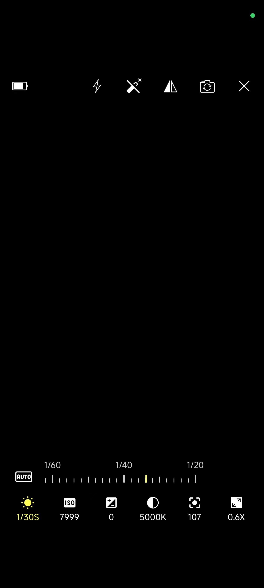
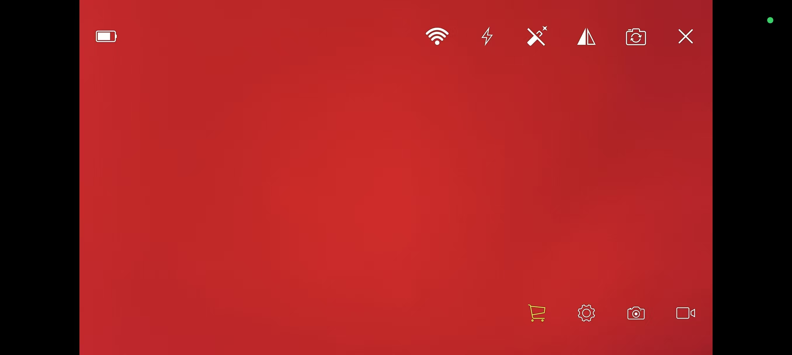
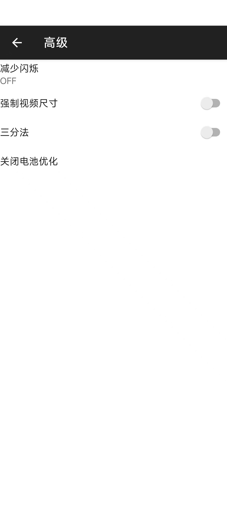
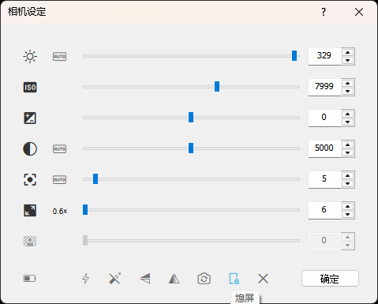
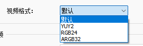

# CameraStream

**质鉴诚监控** — 将手机变为无线 IP 摄像头，实时推流到 PC

[]()
[]()
[]()
[]()

---

## Overview

CameraStream 通过 **LAN 局域网** 将 Android 设备的摄像头实时画面以 **WebSocket 协议** 推流到 PC 端，支持多摄像头切换、硬件编码、手动曝光控制等专业功能。

```
┌──────────────────┐         WebSocket          ┌──────────────────┐
│   Android 设备    │  ──────── H.264/H.265 ────→  │    PC 接收端     │
│  (CameraStream)   │   ←─── 控制指令 ────────   │  (解码 & 显示)   │
└──────────────────┘         UDP发现            └──────────────────┘
```

---

## Features

### 核心功能
| 功能 | 说明 |
|------|------|
| **实时推流** | Camera2 预览帧 → MediaCodec 编码 → WebSocket 二进制帧传输 |
| **多摄像头** | 支持物理多摄（广角/长焦/微距）及逻辑摄像头切换 |
| **硬件编码** | H.264 / H.265 硬件编码，VBR 动态码率 |
| **LAN 发现** | UDP 广播自动发现 PC 接收端（端口 8057） |

### 相机控制
| 控制项 | 说明 |
|--------|------|
| 🔦 手电筒 | 前后摄像头 Torch 控制 |
| 🪞 镜像 | 预览画面水平镜像翻转 |
| ✨ 美颜 | 内置美颜滤镜 |
| 🔍 对焦 | 触摸对焦 + 手动对焦（MF）+ 连续自动对焦 |
| 🔄 变焦 | 平滑缩放（数码/光学） |
| 🌡 白平衡 | 自动 / 白炽灯 / 日光 / 荧光灯 / 阴天 |
| ⏱ 快门 | 手动快门速度设置 |
| 💡 ISO | 感光度手动调节 |
| 📐 曝光补偿 | EV 值调节 |

### 体验优化
| 功能 | 说明 |
|------|------|
| 📱 横竖屏 | TextureView 自适应旋转与比例 |
| 🌙 熄屏推流 | 关闭屏幕后继续推流，降低功耗 |
| 🔌 自动重连 | WebSocket 断开自动恢复 |
| 🤖 自动连接 | 发现 PC 后自动发起连接 |
| ⚙️ 动态设置 | 运行时动态切换分辨率、帧率、编码器 |

---

## Tech Stack

| Layer | Technology |
|-------|-----------|
| **Language** | Kotlin 1.9.20 |
| **Min / Target SDK** | API 24 (Android 7.0) / API 34 (Android 14) |
| **Build** | Android Gradle Plugin 8.2.0, JDK 17 |
| **Camera** | Camera2 API (multi-camera, physical sub-cameras) |
| **Encoding** | MediaCodec (H.264 / H.265 / VP8, hardware accelerated) |
| **Transport** | OkHttp WebSocket (binary frames) |
| **Discovery** | UDP Socket (port 8057) |
| **Async** | Kotlin Coroutines |
| **UI** | Material Components, AndroidX Preference |
| **Architecture** | Single Activity + Settings Activity |

---

## Quick Start

### Prerequisites
- Android Studio Hedgehog (2023.1.1+) or later
- JDK 17
- Android SDK 34

### Build

```bash
git clone https://github.com/HNGM-HP/CameraStream.git
cd CameraStream
./gradlew assembleDebug
```

The debug APK will be generated at `app/build/outputs/apk/debug/`.

### Run

1. **PC 端**：运行配套接收服务（监听 WebSocket 连接、解码并显示画面）
2. **手机端**：手机与 PC 处于同一局域网 → 打开应用 → 自动发现 PC → 点击连接
3. **手动连接**：在 PC 端输入手机 IP 地址直接连接

> 配套 PC 接收端代码见相关仓库。

---

## Screenshots

| Portrait Preview | Landscape Preview | Settings |
|:-:|:-:|:-:|
|  |  |  |
| **PC Receiver** | **Format Support** | |
|  |  | |

---

## Architecture Overview

```
MainActivity
├── AutoFitTextureView      ← 预览渲染 / 镜像变换
├── CameraCapture           ← Camera2 会话 / 拍照 / 对焦 / 测光
├── VideoEncoder            ← MediaCodec 编码管线
├── WebSocketClient          ← OkHttp WS 推流
├── DiscoveryClient          ← UDP 服务发现
├── ClientBeacon             ← UDP 周期性宣告
└── SettingsActivity         ← 参数配置界面
```

### Data Flow
```
Camera2 Sensor
    ↓
ImageReader / CaptureRequest
    ↓
MediaCodec (H.264/H.265)
    ↓ (encoded frames)
WebSocket Binary Frame
    ↓
─── LAN ───→
    ↓
PC Receiver (decode & display)
```

Key design points:
- **Frame-level push** rather than file-based streaming for minimal latency
- **Coroutine-based async** for non-blocking network I/O
- **Dynamic capability enumeration** via CameraManager to adapt to device hardware
- **Auto-fit transform** in TextureView handles rotation, mirroring, and aspect ratio on the GPU

---

## Project Structure

```
CameraStream/
├── app/
│   └── src/main/java/com/hngm/camerastream/
│       ├── MainActivity.kt           # Main screen — preview, controls, streaming, discovery
│       ├── CameraCapture.kt          # Camera2 wrapper — session, focus, metering, multi-cam
│       ├── VideoEncoder.kt           # MediaCodec hardware encoder
│       ├── WebSocketClient.kt        # OkHttp WebSocket client
│       ├── DiscoveryClient.kt        # UDP LAN service discovery
│       ├── ClientBeacon.kt           # Periodic UDP beacon (5s interval)
│       ├── SettingsActivity.kt       # Dynamic settings screen
│       └── AutoFitTextureView.kt     # Adaptive TextureView with transform pipeline
├── build.gradle.kts                  # Root build script (AGP 8.2.0, Kotlin 1.9.20)
├── settings.gradle.kts               # Gradle settings (rootProject.name = "CameraStream")
└── gradle/                           # Gradle wrapper
```

---

## Configuration

| Parameter | Values | Description |
|-----------|--------|-------------|
| Resolution | Auto / 4K / 1080p / 720p / 480p | Capture resolution |
| Frame Rate | 15 / 24 / 30 / 60 fps | Encoding frame rate |
| Encoder | H.264 / H.265 | Hardware codec selection |
| Bitrate | 1–50 Mbps | Video bitrate (VBR) |
| Discovery Port | 8057 (default) | UDP broadcast port |

---

## Roadmap

- [ ] Screen-off streaming optimization
- [ ] Audio capture & streaming
- [ ] WiFi-Direct / P2P mode
- [ ] Configurable bitrate control panel
- [ ] ProGuard rules for release builds
- [ ] CI pipeline with GitHub Actions

---

## License

```
MIT License

Copyright (c) 2024 HNGM-HP

Permission is hereby granted, free of charge, to any person obtaining a copy
of this software and associated documentation files (the "Software"), to deal
in the Software without restriction, including without limitation the rights
to use, copy, modify, merge, publish, distribute, sublicense, and/or sell
copies of the Software, and to permit persons to whom the Software is
furnished to do so, subject to the following conditions:
...
```
